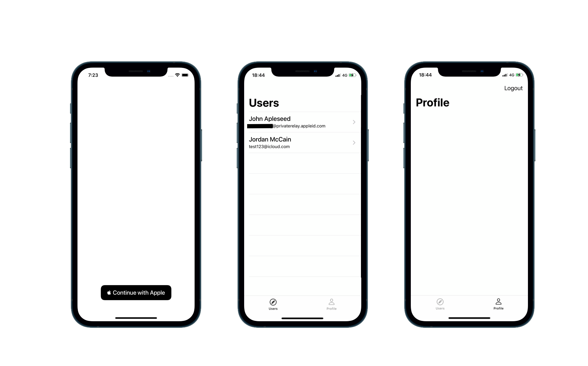

Starter-Social-Firebase

Clone this repository to get started with Firebase auth. The project feature the following:

- Signup/logged in logic at App startup 
- Authentification with "Sign In With Apple"/ Firebase Auth 
- A list of the users who signed up 
- A profile screen whith logout

How to install the app?

1. Create a new project at https://firebase.google.com and download the Google-info.plist
2. Drag the Google-info.plist file inside the project folder
3. Go to the project directory and Run "pod install"
4. Add "Sign In With Apple" capabilities in Xcode main target
5. Activate "Sign In With Apple" on your Firebase console, https://console.firebase.google.com/
6. Run your project on Xcode!
